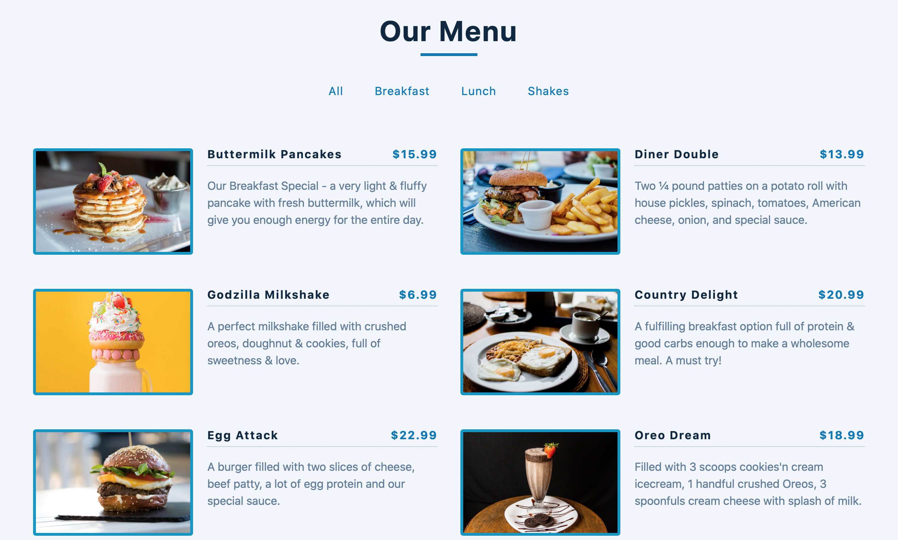

# Restaurant Menu App

A Restaurant Menu app with dynamic category buttons written in React.js

## My process

### Built with

- Semantic HTML5 markup
- CSS custom properties
- CSS Grid & Flexbox
- React.js ⚛️

### What I learned

In this project, I learned about `Set` data structure in JavaScript to store unique values of item categories to display the category buttons. Also, here I learned how to create dynamic buttons instead of hard coding JSX.

Here, in this project, if a new category is introduced in the Menu, it will automatically add a new button for that category.

### Demo

- [Demo](https://webster-restaurant-menu-react.netlify.app)

### Screenshot:

#### React Icons

[react icons](https://react-icons.github.io/react-icons/)

#### Flaticon

I have used Flaticon resource as my favicon.

[Link](https://www.flaticon.com/free-icons/faq)
